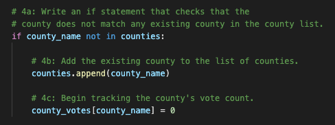
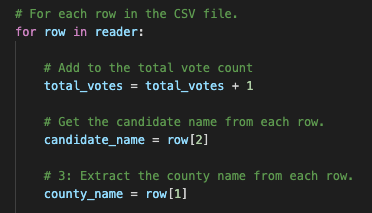

# Election Analysis

## Overview
Several Colorado Board of Elections employees, Tom and Seth, requested an election audit to be conducted of the voting results data from a recent local congressional election. The following tasks were asked to be performed:

- Determine how many votes were cast in the congressional election.
- Provide a breakdown of the number of votes and the percentage of total votes for each county in the precinct.
- Uncover which county had the largest number of votes.
- Provide a breakdown of the number of votes and the percentage of the total votes each candidate received.
- Show which candidate won the election, what their vote count was, and what their percentage of the total votes was.

## Election Audit Results
- **Total votes cast in the congressional election:** 
  - There were 369,711 total votest cast in the election 

- **Number of votes and the percentage of total votes for each county in the precinct:** 
  - Jefferson: 10.5% (38,855)
  - Denver: 82.8% (306,055)
  - Arapahoe: 6.7% (24,801)
  
  The following code example shows how the count-controlled **for** loop was written to capture the county vote and percentage totals.

  

- **County with the largest number of votes?**
  - Denver
- **Number of votes and the percentage of the total votes for each candidate:**
  - Charles Casper Stockham: 23.0% (85,213)
  - Diana DeGette: 73.8% (272,892)
  - Raymon Anthony Doane: 3.1% (11,606)

  The following code example shows how the count-controlled **for** loop was written to capture the candidate vote and percentage totals.

  

- **Candidate who won the election, what their vote count was, and what their percentage of the total votes was:**
  - Winner: Diana DeGette
  - Winning Vote Count: 272,892
  - Winning Percentage: 73.8%

## Election Audit Summary
This script, written to analyze election results and provide deeper insights, has been shown to be effective and scalable. We recommend it be used for other elections. With some simple modifications of the code, it would be a powerful tool to analyze results for an election with any number of candidates or any number of counties, cities, states or other types of regions. Here are several examples of how the code allows for scalability:
1. **The ability to analyze any number of counties or other types of regions, whether that's 3 or 300:** The code is written in a way that allows for more counties to be included. The example below illustrates this: 

2. **The ability to analyze data from any number of column categories, in addition to the existing *Ballot ID*, *County* and *Candidate* categories:** The code is written in a way that allows for scalability. The example below illustrates this, showing how additional categories can be added to *Ballot ID*, *County* and *Candidate*, such as *City* or *State*.

